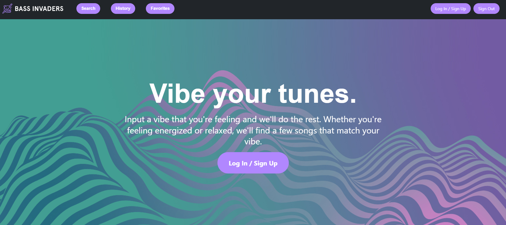
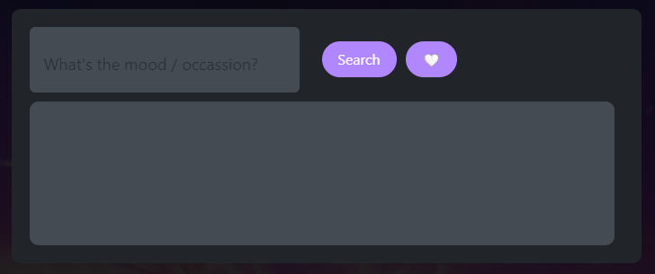

# Bass Invaders
  
  
  ## Description
  
  Introducing a breathtaking fusion of music and technology! Our innovation combines multiple restful APIs, including YouTube and ChatGPT, to bring you a personalized song search like never before. Experience the thrill of finding perfect tunes for your mood or activities, accompanied by captivating YouTube videos. And fear not, our enchanting creation ensures a seamless journey, with the whimsical presence of the Easter bunny to vanquish any glitches. Prepare for an extraordinary musical adventure, where every moment resonates with grandeur!

## Table of Contents 

* [Installation](#installation)

* [Usage](#usage)

* [License](#license)

* [Contributing](#Contributions)

* [Questions](#questions)

## Installation

Go to: (Heroku site)

## Usage

Bass Invaders is an application that allows users utilize the power of AI to generate a playlist. Sometimes we get stuck in a funk and need a pump up song to pull us out, sometimes we need something meditative after a long day of stressful debugging. We created Bass Invaders to alleviate the stress and time it takes to find that perfect tune - just leave that in our hands.

Our simple and easy-to-use interface promotes an energizing musical adventure for techies of all levels - simply tell Bass Invaders what you are looking for, and we will return the perfect playlist designed specifically for you. 

Need to access favorites? Click on the "favorites" tab or scroll to the bottom of the homepage to access your favorites! 

## License

    This project is licensed under a MIT license.
  
## Contributing

Please don't hesitate to leave feedback and constructive criticism! 

## Questions

Please dont hesitate to reach out via email, hmiddleton1017@gmail.com with any questions/comments.

Feel free to check out more at our Githubs ([HannahMidd, brianlucla, callmechelsea, meeekkksss]) at 
(https://github.com/HannahMidd https://github.com/brianlucla https://github.com/callmechelsea https://github.com/meeekkksss/).

